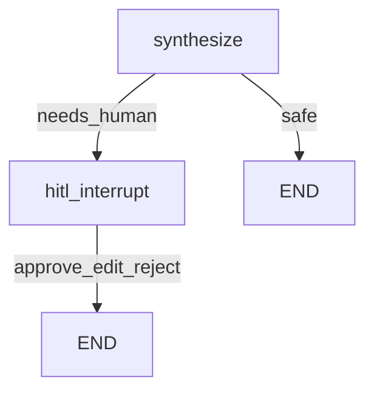

# HITL — gouvernance avant recommandation

## Pourquoi bloquer ?

Une question du type « **dois-je acheter AAPL ?** » n’est plus de l’analyse documentaire : c’est une **recommandation d’investissement**.

Même avec un disclaimer, laisser un LLM répondre librement :

- crée un risque **réglementaire / réputation**
- affaiblit le message portfolio (« je maîtrise la gouvernance IA »)
- mélange faits (10-K, ratios) et **conseil**

## Pattern LangGraph

1. **classify** détecte une question sensible (`is_sensitive_question`)
2. Les workers produisent un **brouillon** (`draft`)
3. Nœud **hitl** appelle `interrupt(payload)` → le graphe **pause**
4. Un humain choisit `approve` | `edit` | `reject` via `Command(resume=...)`
5. Seulement alors la réponse finale est publiée



## Checkpointer

`interrupt()` exige un **checkpointer** + `thread_id` :

- V1 : `MemorySaver` (RAM process)
- Prod : Postgres / Redis checkpointer (Cloud Run multi-instances)

Sans checkpointer, impossible de reprendre après pause.

## API

| Endpoint | Rôle |
|---|---|
| `POST /ask` | SSE ; peut s’arrêter sur `type: interrupt` + `thread_id` |
| `POST /resume` | SSE ; body `{ thread_id, action, edit? }` |

Exemple interrupt payload :

```json
{
  "reason": "sensitive_investment_question",
  "question": "Should I buy AAPL?",
  "draft": "...",
  "actions": ["approve", "edit", "reject"]
}
```

## CLI

```bash
# Interactif : le terminal demande approve/edit/reject
uv run python -m finance_analyst --ticker AAPL "Should I buy Apple stock?"

# Tests non interactifs
uv run python -m finance_analyst --ticker AAPL "Should I buy AAPL?" --auto-resume reject
```

## Ce que ça démontre en entretien

- Tu ne te contentes pas d’un disclaimer en bas de page
- Tu **interromps le graphe** avant publication
- Tu connais le pattern prod `interrupt` + `Command(resume=...)`

## Limites V1

- Checkpointer en mémoire (perdu au redémarrage du process)
- Détection sensible = heuristiques regex (pas un classifieur LLM)
- Pas encore de panneau UI React (phase suivante)
