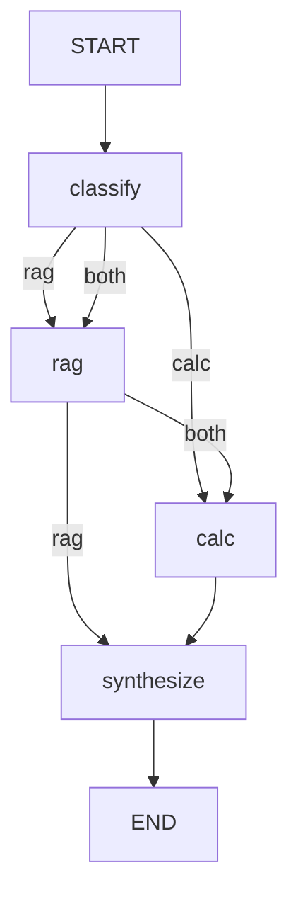

# LangGraph — supervisor multi-agents

Ce document décrit le graphe V1 : un **supervisor** route la question vers le worker RAG, le worker Calcul, ou les deux.

## State (`AnalystState`)

| Champ | Description |
|---|---|
| `question` | Question utilisateur |
| `ticker` | Symbole optionnel (CLI `--ticker` ou détection Apple → AAPL) |
| `route` | `rag` \| `calc` \| `both` |
| `rag_answer` | Texte issu du worker RAG |
| `calc_answer` | Texte issu du worker Calcul |
| `answer` | Réponse finale synthétisée |
| `citations` | Liste fusionnée (chunks 10-K + ligne CSV) |
| `ratios` | Dict structuré si Calcul exécuté |

## Nœuds

1. **classify** — heuristiques FR/EN (roe, margin, risk, factor…) → `route` + `ticker`
2. **rag** — retrieve hybride → grade → generate (comme phase 2)
3. **calc** — ratios Python sur `fundamentals.csv` (ticker requis)
4. **synthesize** — concatène les sections `## Analyse documentaire` + `## Ratios`

## Routing (heuristique)

Pas de LLM pour router en V1 (rapide, testable). Exemples :

- « ROE », « marge », « debt » → **calc**
- « risk factors », « business », « Item 1A » → **rag**
- Les deux familles de mots → **both**

LLM classifier possible plus tard (`use_llm=True` dans `routing.py`).

## Streaming SSE

`POST /ask` émet :

- `start` — question, model
- `step` — `node`: classify \| rag \| calc \| synthesize
- `final` — `answer`, `citations`, `route`
- `error`

CLI : `stream_analyze` agrégé dans `analyze()` pour l’affichage synchrone.

## Fichiers

| Fichier | Rôle |
|---|---|
| `graph/state.py` | TypedDict |
| `graph/routing.py` | classify + extract_ticker |
| `graph/build.py` | `StateGraph` compile |
| `graph/runner.py` | `stream_analyze`, `analyze` |
| `api.py` | `POST /ask` SSE |

## Limites V1

- Checkpointer MemorySaver (HITL) — état perdu au redémarrage process
- Pas encore **UI React**
- Route `both` = séquentiel RAG puis Calcul, pas parallèle
